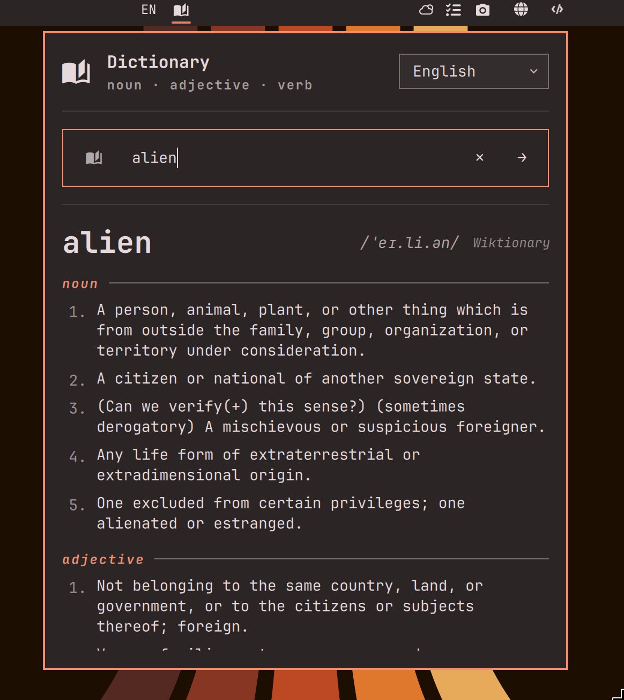

# Omarchy Dictionary

A Quickshell bar widget for Omarchy that looks up word definitions from
Wiktionary, with support for 23 language editions, fuzzy "did you mean?"
suggestions, and a global hotkey for looking up highlighted text anywhere
on your system.

Click the bar icon to open a search field. Type a word and press Enter to
look it up. Use the language dropdown in the panel header to switch editions
between [supported languages](#supported-languages). When no match exists,
up to three similar words are suggested as clickable chips.



## Requirements

- Omarchy (uses the Quickshell bar plugin system)
- Network access to `*.wiktionary.org` — no API key or signup required
- `wl-clipboard` for the global selection hotkey — preinstalled on Omarchy

## Install

```sh
omarchy plugin add https://github.com/tristonarmstrong/omarchy-dictionary.git --enable
```

Optionally place it in the center section after the clock:

```sh
omarchy bar move tristonarmstrong.dictionary --section center --after omarchy.clock
```

## Usage

### Bar search

- Click the bar icon to open the search panel
- Type a word and press Enter to look it up
- Use the language dropdown in the panel header to switch editions
- When no match exists, up to three similar words appear as chips you can
  click to retry
- Press Esc to close the panel

### Global selection hotkey

Bind `SUPER + D` in `~/.config/hypr/bindings.lua` to look up the highlighted
word in any application:

```lua
o.bind("SUPER + D", "Look up selection in dictionary", "omarchy-dictionary-lookup")
```

The plugin auto-installs the bundled `scripts/omarchy-dictionary-lookup` to
`~/.local/bin/` on first load (idempotent — re-runs only when the bundled
copy changes), so no manual install step is needed. The script reads the
Wayland primary selection (highlighted text), falls back to the clipboard
if empty, extracts the first alphabetic word, and opens the dictionary
panel with that word pre-filled. With nothing selected it just opens the
empty panel.

> **Note:** A desktop notification confirms when the script is first
> installed. You may want to inspect it before use — review
> `scripts/omarchy-dictionary-lookup` in the plugin repo, or run
> `cat ~/.local/bin/omarchy-dictionary-lookup` to see what was installed.

### IPC

External callers can drive the plugin via `omarchy-shell`:

```sh
omarchy-shell tristonarmstrong.dictionary search <word>   # search and open
omarchy-shell tristonarmstrong.dictionary open           # open empty panel
omarchy-shell tristonarmstrong.dictionary toggle         # toggle panel
omarchy-shell tristonarmstrong.dictionary close          # close panel
```

## Validate

```sh
omarchy plugin validate ~/.config/omarchy/plugins/tristonarmstrong.dictionary
qmllint -I "$OMARCHY_PATH/shell" \
  ~/.config/omarchy/plugins/tristonarmstrong.dictionary/BarWidget.qml \
  ~/.config/omarchy/plugins/tristonarmstrong.dictionary/Panel.qml
```

## Tests

```sh
bash tests/run.sh
```

Runs three suites — QML lint checks (2), Model.js unit tests (240), and
the lookup-script tests (22) — 264 tests total. Model.js is parsed
in-process; the lookup script's pure functions are exercised in a
subprocess with stubbed `wl-paste` and `omarchy-shell` so the suite
needs no Wayland session or running shell.

## Remove

```sh
omarchy plugin remove tristonarmstrong.dictionary --yes
```

Removes the plugin and (on next shell restart) auto-uninstalls nothing —
the lookup script at `~/.local/bin/omarchy-dictionary-lookup` stays; remove
it manually if you want.

## Supported languages

23 Wiktionary editions, alphabetically by English label:

| Language | Code |
|---|---|
| Arabic | `ar` |
| Bengali | `bn` |
| Chinese | `zh` |
| Dutch | `nl` |
| English | `en` |
| French | `fr` |
| German | `de` |
| Hindi | `hi` |
| Indonesian | `id` |
| Italian | `it` |
| Japanese | `ja` |
| Korean | `ko` |
| Malay | `ms` |
| Persian | `fa` |
| Polish | `pl` |
| Portuguese | `pt` |
| Russian | `ru` |
| Spanish | `es` |
| Swahili | `sw` |
| Swedish | `sv` |
| Thai | `th` |
| Turkish | `tr` |
| Vietnamese | `vi` |

To add another edition, append it to the `LANGUAGES` array in `Model.js`.

## License

MIT.