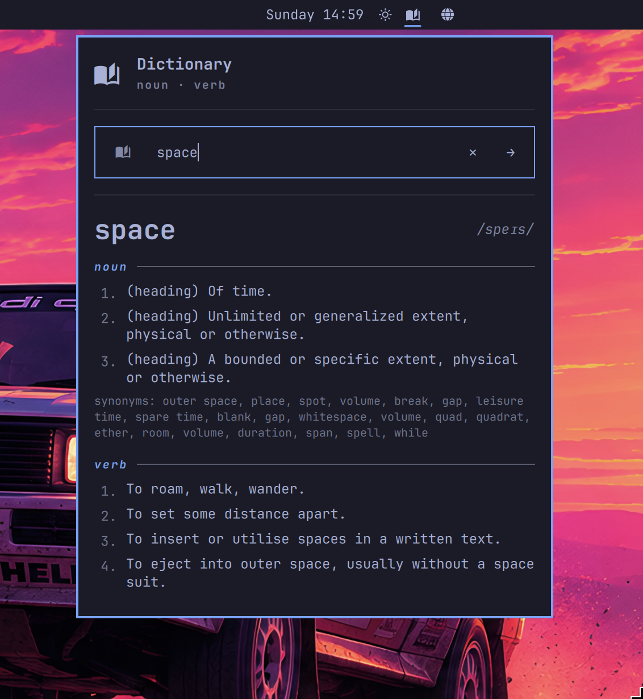

# Omarchy Dictionary

A Quickshell bar widget for Omarchy Quattro that looks up English word definitions from the Free Dictionary API.

Click the bar icon to open a search field. Type a word and press Enter to look it up. Matches show definitions, phonetics, parts of speech, synonyms, and examples. When no match exists, up to three similar words are suggested as clickable chips.



## Requirements

- Omarchy Quattro
- Network access to `api.dictionaryapi.dev` (free public API, no key or signup)
- No external dependencies or privileged setup

## Install

```sh
omarchy plugin add https://github.com/tristonarmstrong/omarchy-dictionary.git --enable
```

If needed, place it in the center section after the clock:

```sh
omarchy bar move tristonarmstrong.dictionary --section center --after omarchy.clock
```

## Usage

- Click the bar icon to open the search panel
- Type a word and press Enter to look it up
- When no match exists, up to three similar words appear as chips you can click to retry
- Press Esc to close the panel

## Validate

```sh
omarchy plugin validate ~/.config/omarchy/plugins/tristonarmstrong.dictionary
qmllint -I "$OMARCHY_PATH/shell" \
  ~/.config/omarchy/plugins/tristonarmstrong.dictionary/BarWidget.qml \
  ~/.config/omarchy/plugins/tristonarmstrong.dictionary/Panel.qml
```

## Remove

```sh
omarchy plugin remove tristonarmstrong.dictionary --yes
```

## License

MIT.